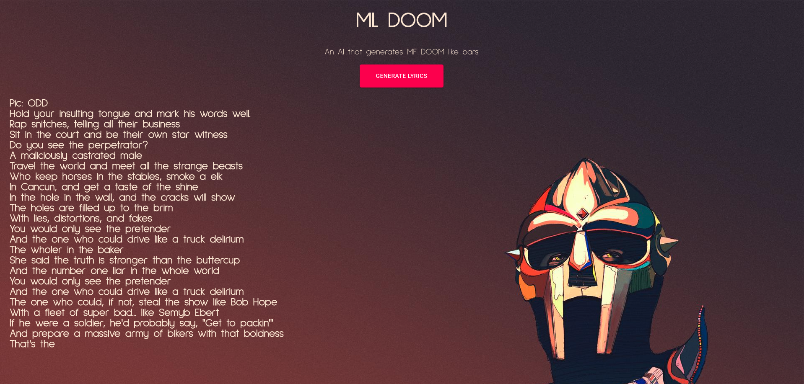

# ML DOOM

ML DOOM is a a project that uses GPT-2 to generate lyrics that mimic your favourite rapper's favourite rapper: MF DOOM.

---

### How does it work?
ML DOOM uses GPT-2, a transformer-based language model that was trained on 8 million web pages. The model was fine-tuned using using over 1800 MF DOOM lyrics scraped using Beautiful soup. I don't have a GPU on my machine, so I trained my model on Colab and imported a `checkpoint/` folder to my local directory. The model was then put on a Flask application to communicate to the React front end. 

---

### How can I run this on my machine?
1. Add `mfdoom.txt` to your google drive
2. Follow the instructions on [this Colab notebook](https://colab.research.google.com/drive/11WefYtgmUY58m6mngRqXEoR9C_SEJ0TU?usp=sharing) (this will take forever)
3. Download the `checkpoint/` to your local directory
4. Add a `config.py` file to the main directory and add a `GENIUS_API_TOKEN` variable
5. Run the following commands for the backend:
```bash
$ pip install -r requirements.txt

$ python server.py
```
6. Run the following commands for the front-end
```
$ cd frontend

$ npm i 

$ npm start
```
7. Do whatever you want with it. If it's cool, make a pull request 😼

---

### Some demo images


Some sample lyrics generated (I'm going to censor out some no-no words):
```
Break
He sold crack, no surrender, no escape, now stop messing with that ****
****, he really live up in thier self
If I lived in San Francisco, I'd probably be locked up
On the street corner, looking for something sweet
Kid-face, I'm Captain America, black cape, jaw-dropping
When it comes to threesome flirting, shee-wee's empty
Got no interest in threesome with a fat ugly face
To make a **** flaunt his ugly face, look like a pig
Hiking in the sun, reflecting the sun
Sunset, my mind is Heaven's gate so try to flee
My friends and I, we all wish we had a cooler mind
But, uh, I always knew that when a **** has the chance
I'll do my thing, and when not, I'll be toe-to-toe
Ain't nobody in business, feelin' free to bite
Dynasties destroyed like Carringtons and Colbys
Noise, like Chito Ardiles, with his bob and his stink
Nobody knows the trouble I see
From the MPV fly dirty tailin

Guys make me sick to my stomachs' bars, Kurt Angle
Raw lining, Paul Simon touring, Random people doing just that
Hey how you doing?
I been doing this since 3:30 a.m.
Ever since I last used to wake up"
"Hey!"
"Hey!""Hey!""Hey!""Hey!""Hey!""
Takeoff, something out of the ordinary
This place is freakin' out
This is what these egomaniacs think
They can't fathom when they thinkin' big
They imagine it's a chore, a Hollywood stunt
I tell off the bat, no ill will from the Devil
I ain't playin' dumb, I'm serious
These egomaniacs think they best bet is to just...****...me
**** it, you silly, I'm serious
**** it, you silly, I'm faithful
**** it, you silly, I'm labor intensive
I'll give you financial help, like a lab deal
What are you going to go through?
These egomaniacs think they know all the secrets
They're just too hard to grasp
It's a massive stash, we all
```
